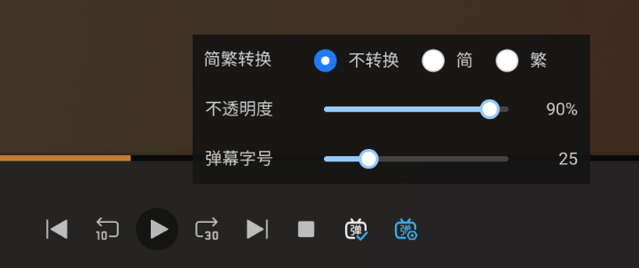

# Plex 弹幕

网页客户端的弹幕插件，支持 Plex 4.116

[ViolentMonkey](https://violentmonkey.github.io) 或者 [TamperMonkey](https://www.tampermonkey.net) 加载 [dist/danmu.user.js](dist/danmu.user.js)

## Demo

### 设置栏

## Alternatives
[lsl330/plex-danmaku](https://github.com/lsl330/plex-danmaku)

[Mr-Quin/danmaku-anywhere](https://github.com/Mr-Quin/danmaku-anywhere)

## Useful Links
[AutoBangumi](https://www.autobangumi.org)

[弹弹Play API](https://api.dandanplay.net/swagger/ui/index)

[Plex命名规范](https://support.plex.tv/articles/naming-and-organizing-your-tv-show-files)

[weizhenye/Danmaku](https://github.com/weizhenye/Danmaku)